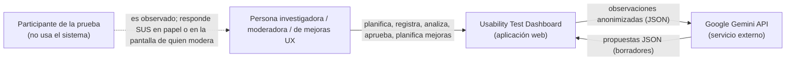
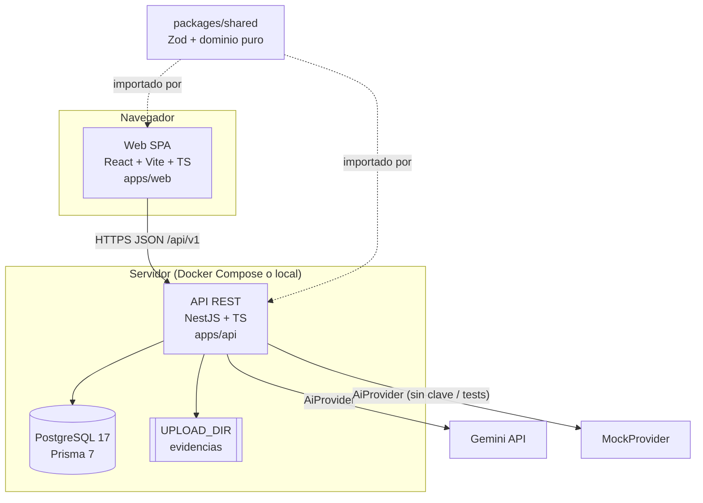
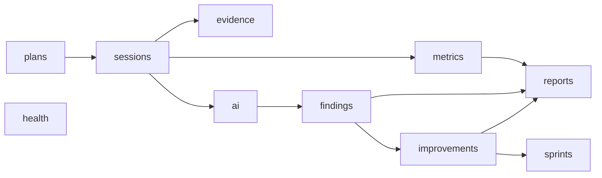
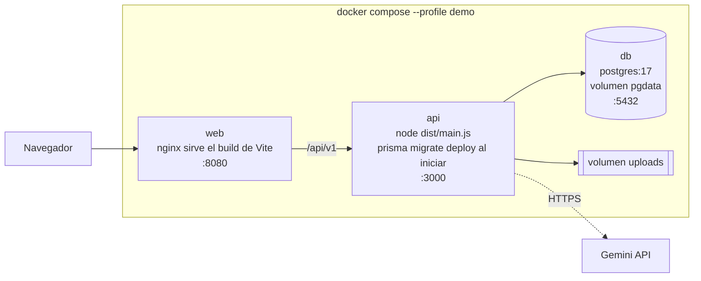

# Arquitectura (C4 niveles 1–2) y despliegue

## Nivel 1 — Contexto

## Nivel 2 — Contenedores

## Módulos de la API

## Despliegue (perfil demo)

En desarrollo solo corren `db` (y `db_test` para e2e) en Docker; API y web corren con `pnpm dev`.
