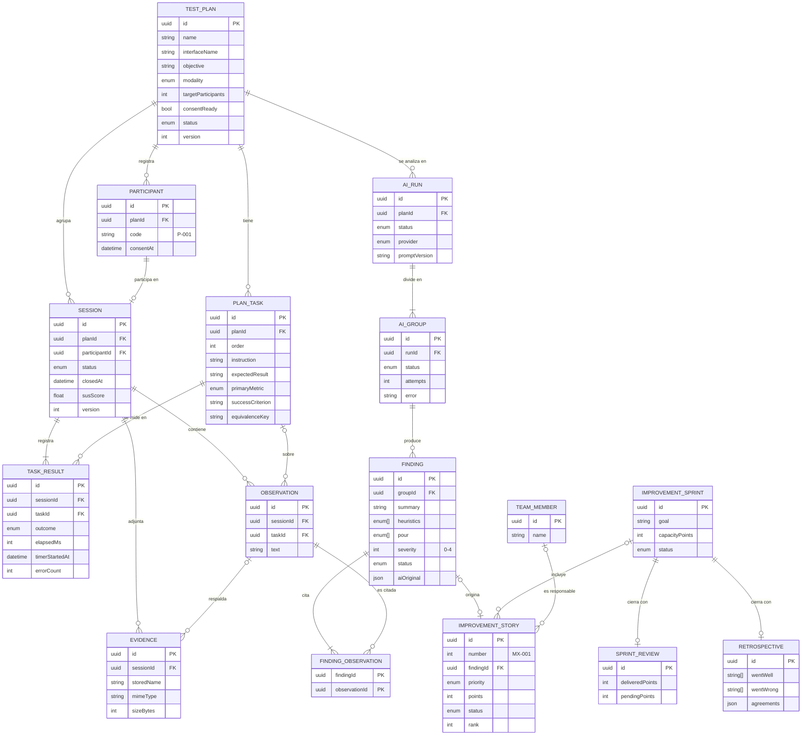

# Diagrama entidad–relación

Detalle de campos y tipos en [`../DATA_MODEL.md`](../DATA_MODEL.md).

```mermaid
erDiagram
  TEST_PLAN ||--o{ PLAN_TASK : "tiene"
  TEST_PLAN ||--o{ PARTICIPANT : "registra"
  TEST_PLAN ||--o{ SESSION : "agrupa"
  PARTICIPANT ||--o| SESSION : "participa en"
  SESSION ||--|{ TASK_RESULT : "registra"
  PLAN_TASK ||--o{ TASK_RESULT : "se mide en"
  SESSION ||--o{ OBSERVATION : "contiene"
  PLAN_TASK |o--o{ OBSERVATION : "sobre"
  SESSION ||--o{ EVIDENCE : "adjunta"
  OBSERVATION |o--o{ EVIDENCE : "respalda"
  TEST_PLAN ||--o{ AI_RUN : "se analiza en"
  AI_RUN ||--|{ AI_GROUP : "divide en"
  AI_GROUP ||--o{ FINDING : "produce"
  FINDING ||--|{ FINDING_OBSERVATION : "cita"
  OBSERVATION ||--o{ FINDING_OBSERVATION : "es citada"
  FINDING |o--o| IMPROVEMENT_STORY : "origina"
  IMPROVEMENT_SPRINT |o--o{ IMPROVEMENT_STORY : "incluye"
  TEAM_MEMBER |o--o{ IMPROVEMENT_STORY : "es responsable"
  IMPROVEMENT_SPRINT ||--o| SPRINT_REVIEW : "cierra con"
  IMPROVEMENT_SPRINT ||--o| RETROSPECTIVE : "cierra con"

  TEST_PLAN {
    uuid id PK
    string name
    string interfaceName
    string objective
    enum modality
    int targetParticipants
    bool consentReady
    enum status
    int version
  }
  PLAN_TASK {
    uuid id PK
    uuid planId FK
    int order
    string instruction
    string expectedResult
    enum primaryMetric
    string successCriterion
    string equivalenceKey
  }
  PARTICIPANT {
    uuid id PK
    uuid planId FK
    string code "P-001"
    datetime consentAt
  }
  SESSION {
    uuid id PK
    uuid planId FK
    uuid participantId FK
    enum status
    datetime closedAt
    float susScore
    int version
  }
  TASK_RESULT {
    uuid id PK
    uuid sessionId FK
    uuid taskId FK
    enum outcome
    int elapsedMs
    datetime timerStartedAt
    int errorCount
  }
  OBSERVATION {
    uuid id PK
    uuid sessionId FK
    uuid taskId FK
    string text
  }
  EVIDENCE {
    uuid id PK
    uuid sessionId FK
    string storedName
    string mimeType
    int sizeBytes
  }
  AI_RUN {
    uuid id PK
    uuid planId FK
    enum status
    enum provider
    string promptVersion
  }
  AI_GROUP {
    uuid id PK
    uuid runId FK
    enum status
    int attempts
    string error
  }
  FINDING {
    uuid id PK
    uuid groupId FK
    string summary
    enum[] heuristics
    enum[] pour
    int severity "0-4"
    enum status
    json aiOriginal
  }
  FINDING_OBSERVATION {
    uuid findingId PK
    uuid observationId PK
  }
  IMPROVEMENT_STORY {
    uuid id PK
    int number "MX-001"
    uuid findingId FK
    enum priority
    int points
    enum status
    int rank
  }
  IMPROVEMENT_SPRINT {
    uuid id PK
    string goal
    int capacityPoints
    enum status
  }
  TEAM_MEMBER {
    uuid id PK
    string name
  }
  SPRINT_REVIEW {
    uuid id PK
    int deliveredPoints
    int pendingPoints
  }
  RETROSPECTIVE {
    uuid id PK
    string[] wentWell
    string[] wentWrong
    json agreements
  }
```
