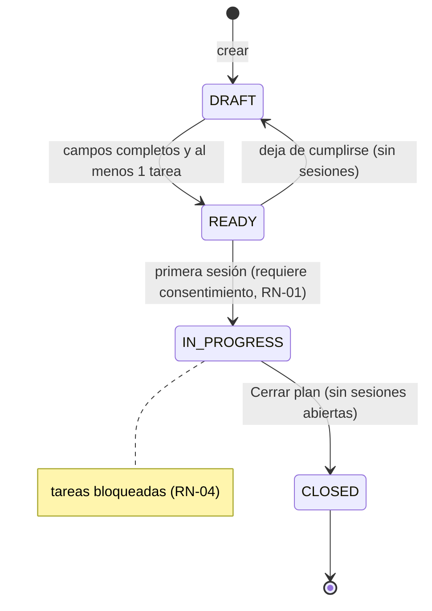
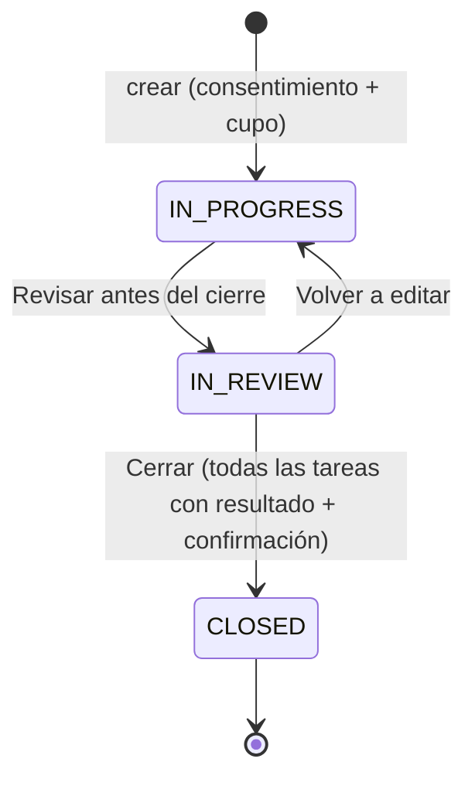
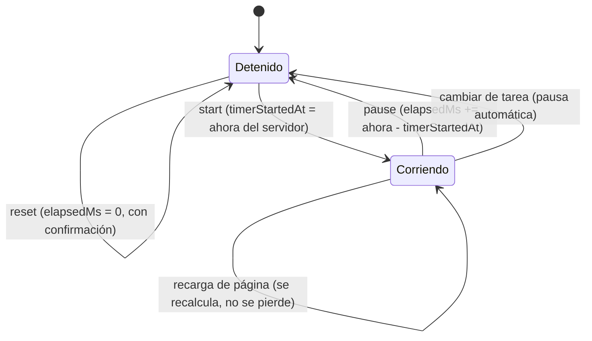
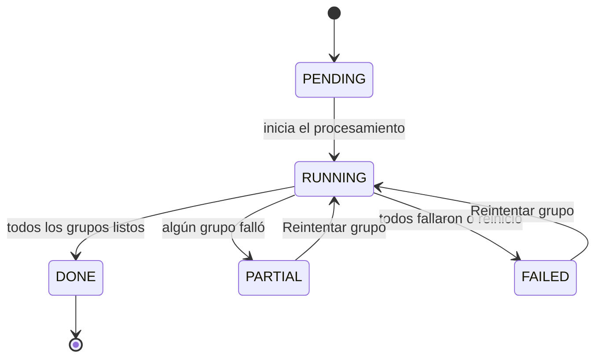
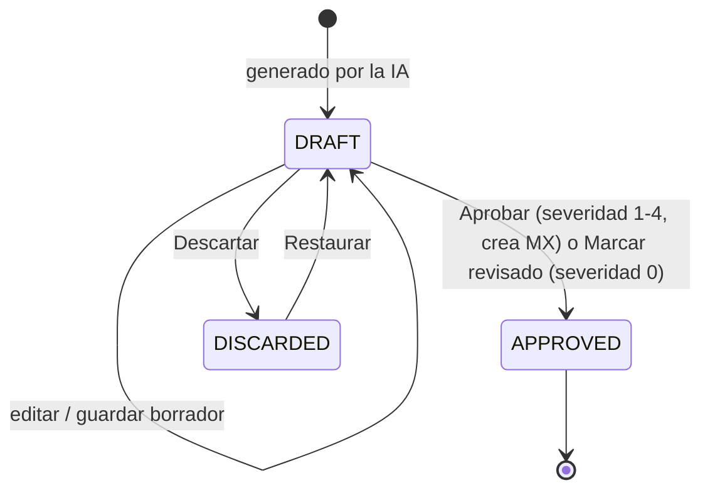
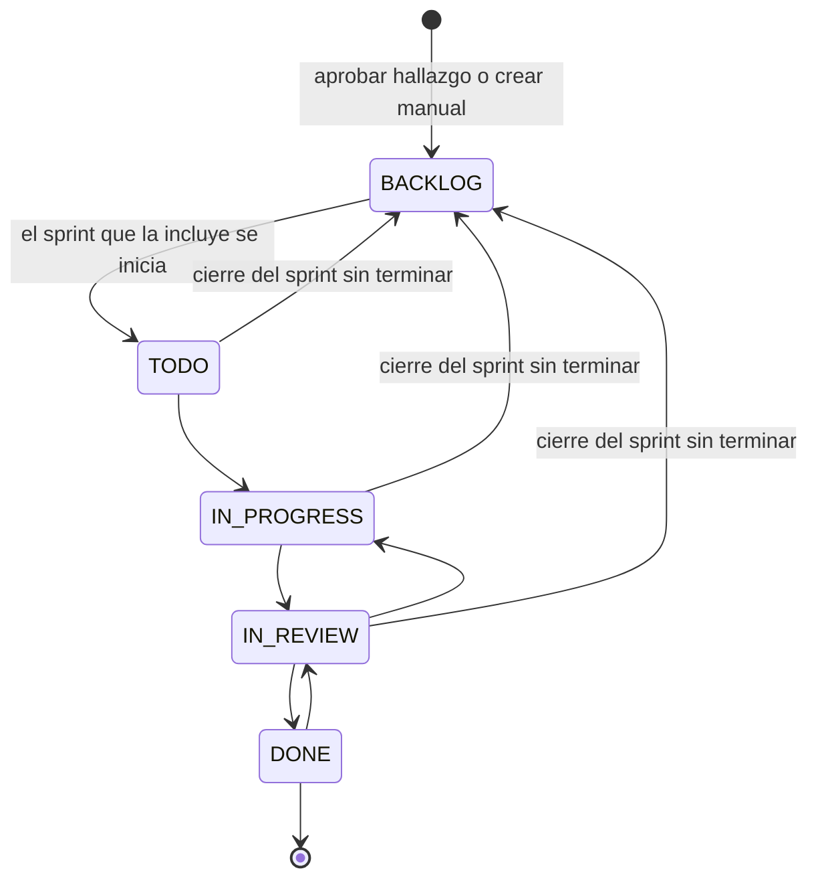
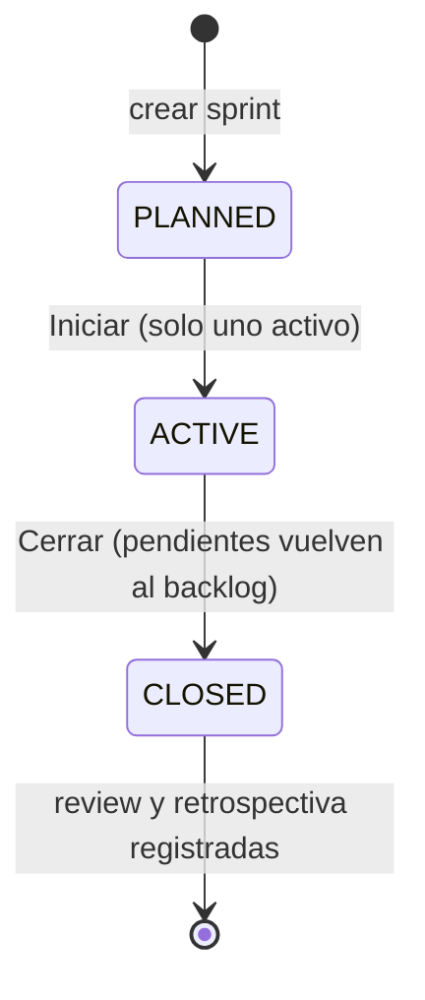

# Máquinas de estado

Reglas en [`../BUSINESS_RULES.md`](../BUSINESS_RULES.md).

## Plan de prueba (RN-16)

## Sesión (RN-05)

## Cronómetro de una tarea (RN-08)

## Análisis de IA (RN-18)

## Hallazgo (RN-09)

## Historia MX y sprint de mejoras (RN-11, RN-14, RN-19)

