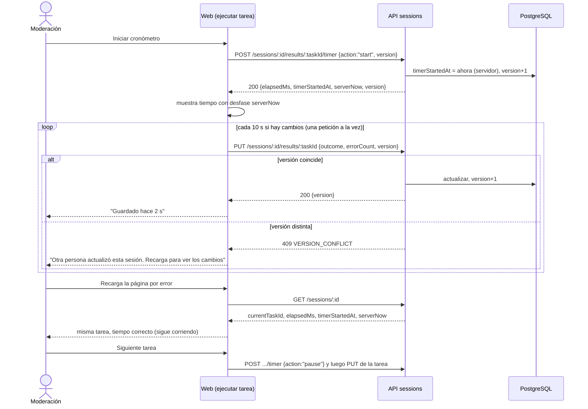
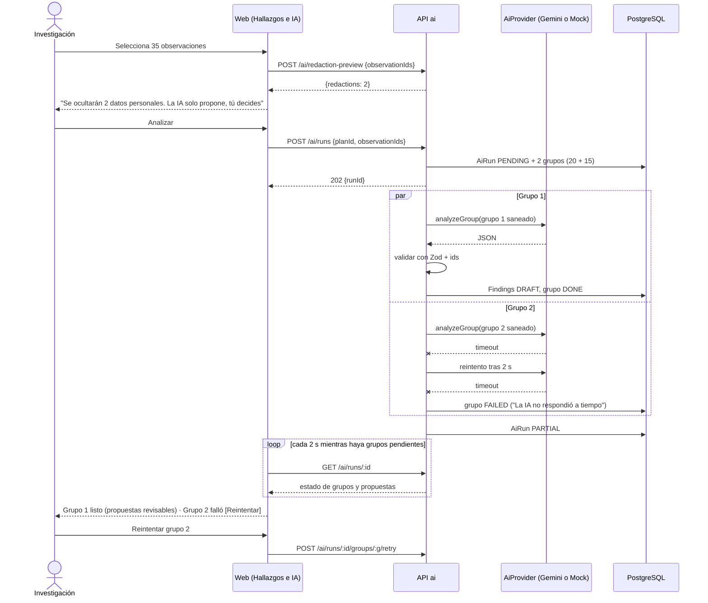
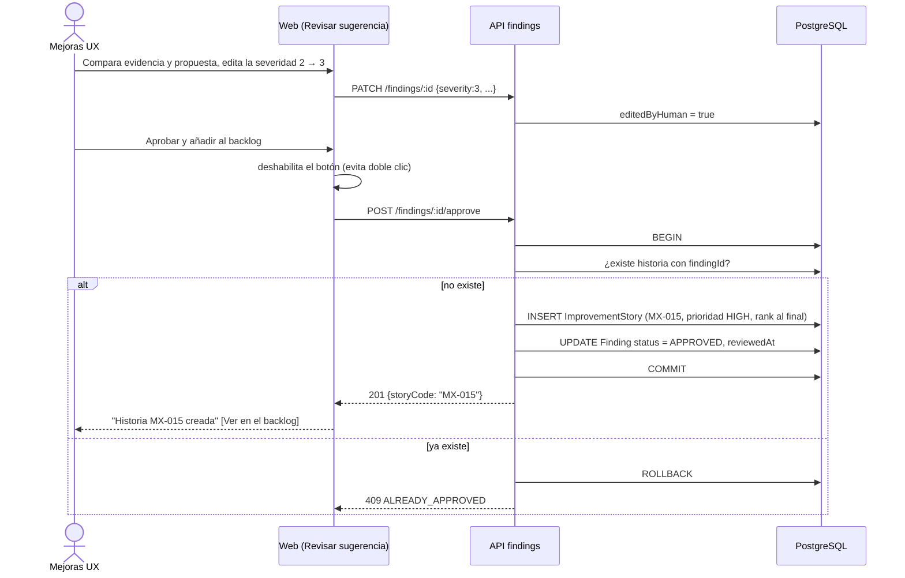

# Diagramas de secuencia

## 1. Registrar una tarea con cronómetro y autoguardado (HU-02, RN-08, RN-21)

## 2. Análisis con IA y fallo parcial (HU-06, RN-17, RN-18)

## 3. Aprobar una propuesta y crear la historia MX (HU-07, HU-08, RN-09, RN-10)

