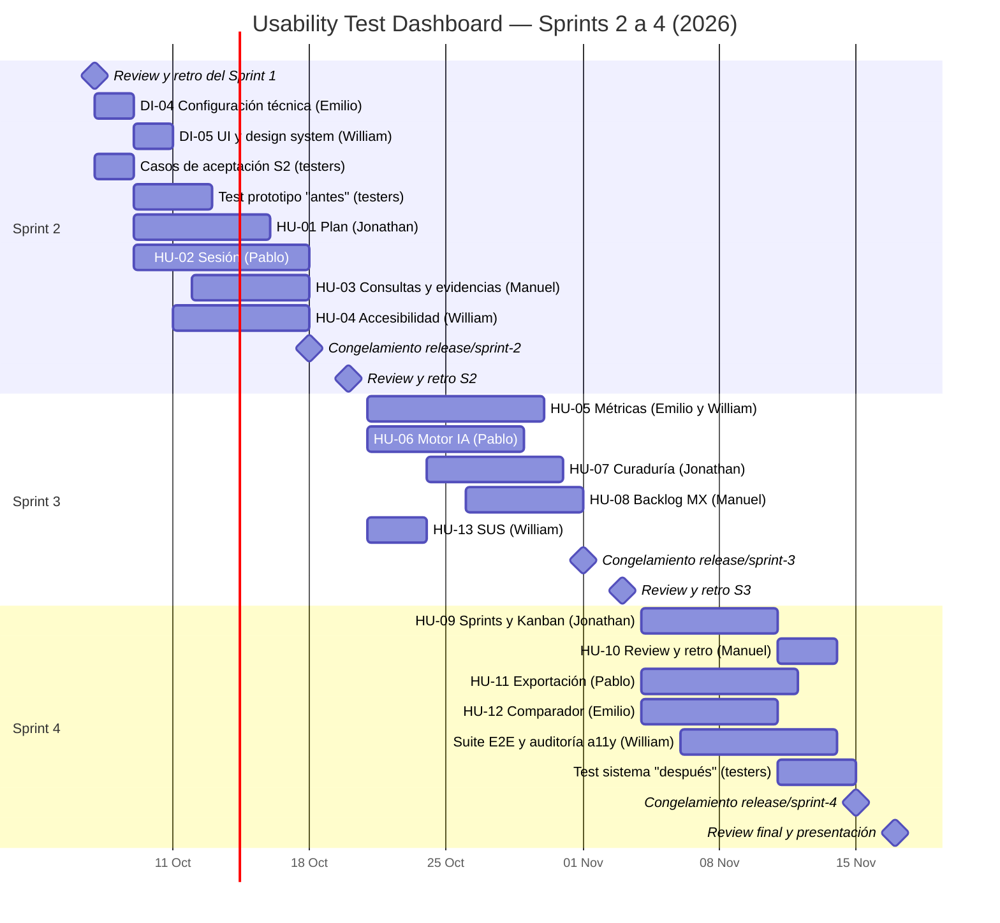
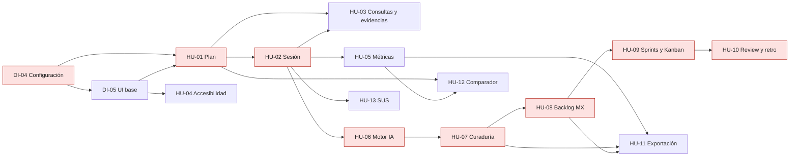

# Cronograma y dependencias

## Cronograma (Sprints 2–4)

## Dependencias entre historias

En rojo: ruta crítica. El seed de DI-04 incluye sesiones cerradas y observaciones para que HU-05 y
HU-06 puedan empezar el 21 de octubre aunque HU-02 tenga ajustes pendientes.
