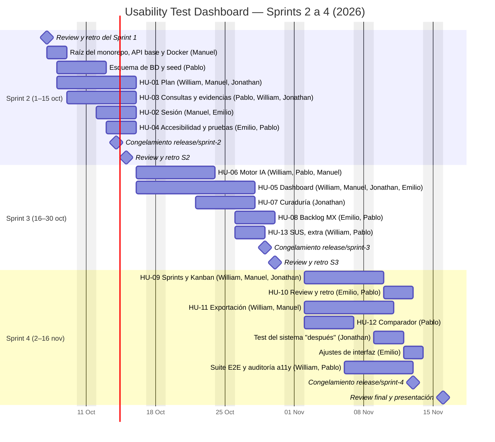
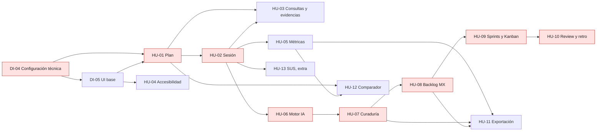

# Cronograma y dependencias

## Cronograma (Sprints 2–4)

Fechas de la matriz oficial (S2 1–15 oct, S3 16–30 oct, S4 2–16 nov). El S2 se dibuja desde el 7 oct
porque el repositorio recién recibe el código esa semana. Cada barra agrupa las líneas de la matriz de
esa historia (las personas entre paréntesis). Solo se cuentan días hábiles.

> **Aviso de capacidad:** la matriz supone 2 h por persona por día. Del 7 al 15 oct son 7 días hábiles
> (≈ 14 h por persona) y el plan del S2 pide 18–20 h. Si parte del trabajo ya se hizo del 1 al 6 oct, cabe;
> si no, hay que subir las horas diarias o recortar alcance con el PO (ver `RISKS.md` P1).

## Dependencias entre historias

En rojo: ruta crítica. El seed de DI-04 incluye sesiones cerradas y observaciones para que HU-05 y
HU-06 puedan empezar el 16 de octubre aunque HU-02 tenga ajustes pendientes.
