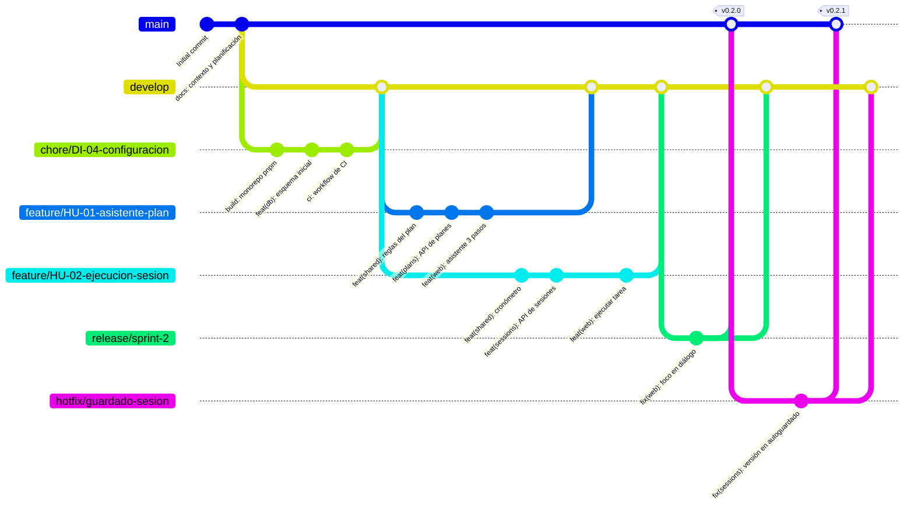

# Flujo de ramas

Reglas completas en [`../WORKFLOW.md`](../WORKFLOW.md).

```mermaid
gitGraph
  commit id: "Initial commit"
  commit id: "docs: contexto y planificación"
  branch develop
  checkout develop
  branch chore/DI-04-configuracion
  checkout chore/DI-04-configuracion
  commit id: "build: monorepo pnpm"
  commit id: "feat(db): esquema inicial"
  commit id: "ci: workflow de CI"
  checkout develop
  merge chore/DI-04-configuracion
  branch feature/HU-01-asistente-plan
  checkout feature/HU-01-asistente-plan
  commit id: "feat(shared): reglas del plan"
  commit id: "feat(plans): API de planes"
  commit id: "feat(web): asistente 3 pasos"
  checkout develop
  branch feature/HU-02-ejecucion-sesion
  checkout feature/HU-02-ejecucion-sesion
  commit id: "feat(shared): cronómetro"
  commit id: "feat(sessions): API de sesiones"
  checkout develop
  merge feature/HU-01-asistente-plan
  checkout feature/HU-02-ejecucion-sesion
  commit id: "feat(web): ejecutar tarea"
  checkout develop
  merge feature/HU-02-ejecucion-sesion
  branch release/sprint-2
  checkout release/sprint-2
  commit id: "fix(web): foco en diálogo"
  checkout main
  merge release/sprint-2 tag: "v0.2.0"
  checkout develop
  merge release/sprint-2
  checkout main
  branch hotfix/guardado-sesion
  checkout hotfix/guardado-sesion
  commit id: "fix(sessions): versión en autoguardado"
  checkout main
  merge hotfix/guardado-sesion tag: "v0.2.1"
  checkout develop
  merge hotfix/guardado-sesion
```
