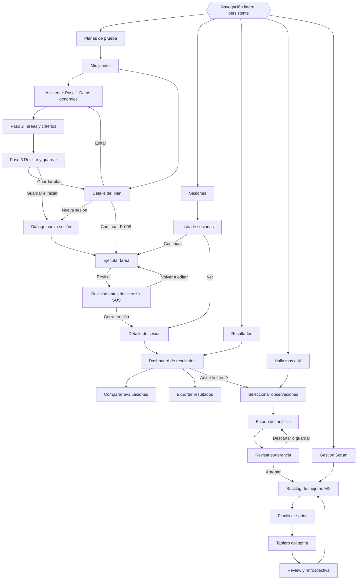

# Mapa de navegación

Basado en los recorridos del Sprint 1 (Configurar, Registrar, Interpretar, Mejorar, Planificar).
Especificación de cada pantalla en [`../HCI_DESIGN.md`](../HCI_DESIGN.md) §5.

