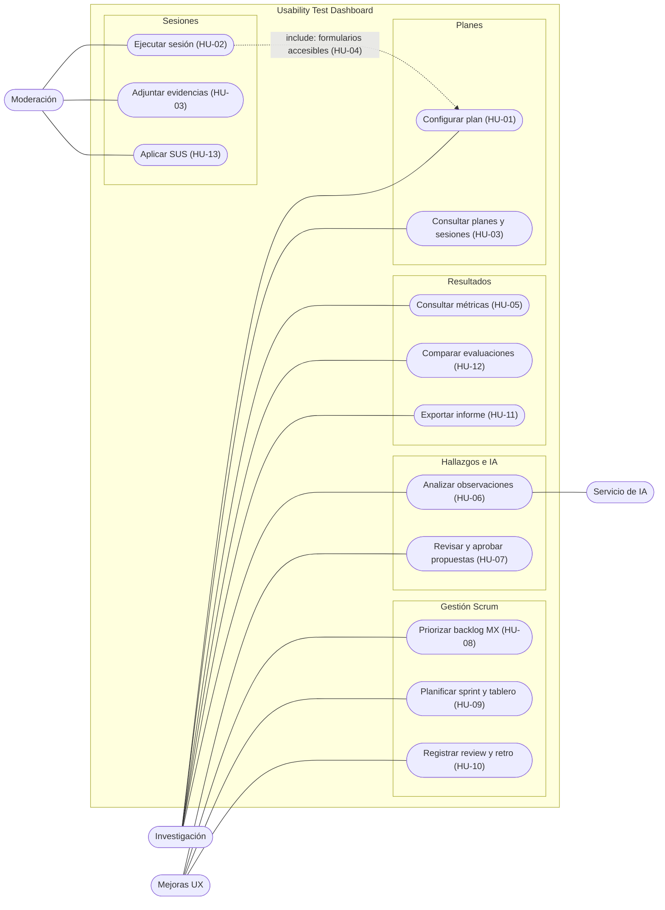

# Casos de uso

Mermaid no tiene diagrama UML de casos de uso; se representa con actores y casos agrupados por
módulo. Para el informe formal puede redibujarse en draw.io con la misma información.

